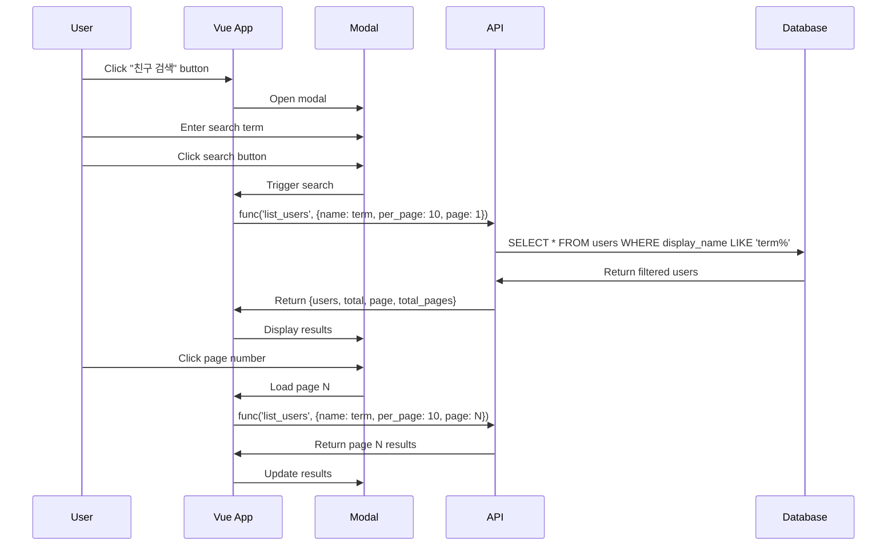

# Design Document

## Overview

사용자 목록 페이지에 Bootstrap 모달 기반의 친구 검색 기능을 추가합니다. Vue.js를 사용하여 검색 상태를 관리하고, 기존 `list_users` API를 활용하여 `display_name` 필터링을 수행합니다. 검색 결과는 10개 단위로 페이지네이션되며, Bootstrap pagination 컴포넌트를 사용합니다.

## Architecture

### Component Structure

```
page/user/list.php (Vue.js App)
├── Friend Search Button (trigger)
├── Friend Search Modal (Bootstrap Modal)
│   ├── Search Input Field
│   ├── Search Button
│   ├── Search Results Grid
│   │   └── User Cards (10 per page)
│   └── Pagination Bar (Bootstrap)
└── Existing User List (unchanged)
```

### Data Flow



## Components and Interfaces

### 1. Friend Search Button

**Location**: Top of user list page, above the "내 친구 목록" section

**HTML Structure**:
```html
<button @click="openSearchModal" class="btn btn-primary mb-3">
    <i class="bi bi-search me-2"></i>
    친구 검색
</button>
```

**Styling**: Bootstrap primary button with search icon

### 2. Friend Search Modal

**Bootstrap Modal Component**:
```html
<div class="modal fade" id="friendSearchModal" tabindex="-1">
    <div class="modal-dialog modal-lg">
        <div class="modal-content">
            <div class="modal-header">
                <h5 class="modal-title">친구 검색</h5>
                <button type="button" class="btn-close" @click="closeSearchModal"></button>
            </div>
            <div class="modal-body">
                <!-- Search Input -->
                <div class="input-group mb-3">
                    <input v-model="searchTerm" 
                           @keyup.enter="performSearch"
                           type="text" 
                           class="form-control" 
                           placeholder="이름을 입력하세요">
                    <button @click="performSearch" 
                            class="btn btn-primary"
                            :disabled="searchLoading">
                        <span v-if="searchLoading">검색 중...</span>
                        <span v-else>검색</span>
                    </button>
                </div>
                
                <!-- Search Results -->
                <div v-if="searchResults.length > 0" class="row g-3">
                    <!-- User cards (same structure as main list) -->
                </div>
                
                <!-- No Results Message -->
                <div v-else-if="searchPerformed && searchResults.length === 0" 
                     class="alert alert-info">
                    검색 결과가 없습니다.
                </div>
                
                <!-- Pagination -->
                <nav v-if="searchTotalPages > 1" class="mt-4">
                    <ul class="pagination justify-content-center">
                        <!-- Pagination controls -->
                    </ul>
                </nav>
            </div>
        </div>
    </div>
</div>
```

**Modal Control**: Use Bootstrap 5 Modal API via JavaScript

### 3. Search Input Field

**Type**: Text input with Enter key support

**Features**:
- Two-way binding with Vue.js (`v-model="searchTerm"`)
- Enter key triggers search (`@keyup.enter="performSearch"`)
- Placeholder text: "이름을 입력하세요"
- Bootstrap form-control styling

### 4. Search Button

**Features**:
- Triggers `performSearch()` method
- Disabled during loading (`searchLoading` state)
- Shows "검색 중..." during API call
- Bootstrap primary button styling

### 5. Search Results Grid

**Layout**: Same card layout as main user list (2 columns on mobile)

**User Card Structure**:
```html
<div class="col-6">
    <div class="card h-100">
        <div class="card-body p-2 d-flex align-items-center">
            <!-- Profile Photo (clickable link) -->
            <a :href="profileUrl(user)" class="flex-shrink-0 me-2">
                
                <div v-else class="rounded-circle bg-secondary bg-opacity-25 
                                   d-inline-flex align-items-center justify-content-center"
                     style="width: 50px; height: 50px;">
                    <i class="bi bi-person fs-5 text-secondary"></i>
                </div>
            </a>
            
            <!-- User Info (clickable link) -->
            <a :href="profileUrl(user)" class="flex-grow-1 min-w-0 text-decoration-none">
                <h6 class="card-title mb-0 text-truncate text-dark">
                    {{ user.display_name }}
                </h6>
                <p class="card-text text-muted mb-0" style="font-size: 0.75rem;">
                    {{ formatDate(user.created_at) }}
                </p>
            </a>
        </div>
    </div>
</div>
```

**Note**: No friend request button in search results (keep it simple)

### 6. Pagination Bar

**Bootstrap Pagination Component**:
```html
<nav class="mt-4">
    <ul class="pagination justify-content-center">
        <!-- First Page -->
        <li class="page-item" :class="{disabled: searchPage === 1}">
            <a class="page-link" @click.prevent="goToSearchPage(1)">
                <i class="bi bi-chevron-double-left"></i>
            </a>
        </li>
        
        <!-- Previous Page -->
        <li class="page-item" :class="{disabled: searchPage === 1}">
            <a class="page-link" @click.prevent="goToSearchPage(searchPage - 1)">
                <i class="bi bi-chevron-left"></i>
            </a>
        </li>
        
        <!-- Page Numbers (dynamic range) -->
        <li v-for="pageNum in visiblePageNumbers" 
            :key="pageNum"
            class="page-item" 
            :class="{active: pageNum === searchPage}">
            <a class="page-link" @click.prevent="goToSearchPage(pageNum)">
                {{ pageNum }}
            </a>
        </li>
        
        <!-- Next Page -->
        <li class="page-item" :class="{disabled: searchPage === searchTotalPages}">
            <a class="page-link" @click.prevent="goToSearchPage(searchPage + 1)">
                <i class="bi bi-chevron-right"></i>
            </a>
        </li>
        
        <!-- Last Page -->
        <li class="page-item" :class="{disabled: searchPage === searchTotalPages}">
            <a class="page-link" @click.prevent="goToSearchPage(searchTotalPages)">
                <i class="bi bi-chevron-double-right"></i>
            </a>
        </li>
    </ul>
</nav>
```

**Pagination Logic**:
- Show 5 page numbers at a time
- Center current page when possible
- Adjust range at boundaries (first/last pages)

## Data Models

### Vue.js Data Properties

```javascript
data() {
    return {
        // Existing properties...
        users: [],
        total: 0,
        currentPage: 1,
        perPage: 20,
        myFriends: [],
        loading: false,
        hasMore: true,
        myUserId: null,
        
        // New search-related properties
        searchModalOpen: false,        // Modal visibility state
        searchTerm: '',                // User input search term
        searchResults: [],             // Array of user objects
        searchPage: 1,                 // Current search results page
        searchTotalPages: 0,           // Total pages for search results
        searchTotal: 0,                // Total number of search results
        searchLoading: false,          // Search API call in progress
        searchPerformed: false,        // Whether search has been performed
        modalInstance: null            // Bootstrap Modal instance
    };
}
```

### API Request/Response

**Request to `list_users` API**:
```javascript
{
    func: 'list_users',
    name: 'searchTerm',  // LIKE 'searchTerm%' in SQL
    per_page: 10,
    page: 1
}
```

**Response from `list_users` API**:
```javascript
{
    page: 1,
    per_page: 10,
    total: 25,           // Total matching users
    total_pages: 3,      // Ceiling(25 / 10)
    users: [
        {
            id: 1,
            firebase_uid: 'abc123',
            display_name: '홍길동',
            created_at: 1234567890,
            photo_url: 'https://...',
            birthday: 631152000,
            gender: 'M'
        },
        // ... 9 more users
    ],
    func: 'list_users'
}
```

## Error Handling

### Search Errors

1. **Empty Search Term**:
   - Show alert: "검색어를 입력해주세요"
   - Do not call API

2. **API Error**:
   - Catch error in try-catch block
   - Show alert with error message
   - Log error to console
   - Reset `searchLoading` state

3. **No Results**:
   - Display message: "검색 결과가 없습니다"
   - Show empty state in modal body

### Modal Errors

1. **Modal Initialization Failure**:
   - Log error to console
   - Fallback: Use manual modal control (add/remove classes)

## Testing Strategy

### Manual Testing Checklist

1. **Button Display**:
   - [ ] Button appears at top of page
   - [ ] Button has correct icon and text
   - [ ] Button is styled correctly

2. **Modal Functionality**:
   - [ ] Modal opens when button clicked
   - [ ] Modal closes with close button
   - [ ] Modal closes with backdrop click
   - [ ] Modal closes with ESC key

3. **Search Functionality**:
   - [ ] Search works with button click
   - [ ] Search works with Enter key
   - [ ] Empty search shows alert
   - [ ] Valid search returns results
   - [ ] No results shows message
   - [ ] Loading state displays correctly

4. **Search Results**:
   - [ ] Results display in card layout
   - [ ] Profile photos display correctly
   - [ ] Default avatars show when no photo
   - [ ] Display names are correct
   - [ ] Dates format correctly
   - [ ] Links navigate to profile pages

5. **Pagination**:
   - [ ] Pagination shows when > 10 results
   - [ ] Page numbers are correct
   - [ ] Current page is highlighted
   - [ ] First/last buttons work
   - [ ] Previous/next buttons work
   - [ ] Page number clicks work
   - [ ] Disabled states work correctly

6. **Responsive Design**:
   - [ ] Modal is responsive on mobile
   - [ ] Cards display 2 per row on mobile
   - [ ] Pagination is readable on mobile

### Integration Testing

1. **API Integration**:
   - Test with various search terms
   - Test with special characters
   - Test with Korean, English, numbers
   - Test pagination with large result sets

2. **User Flow**:
   - Open modal → Search → View results → Click pagination → View profile
   - Open modal → Search → No results → Close modal
   - Open modal → Empty search → See alert → Enter term → Search

## Implementation Notes

### Bootstrap Modal Integration

Use Bootstrap 5 Modal API:
```javascript
// In mounted() hook
this.modalInstance = new bootstrap.Modal(
    document.getElementById('friendSearchModal')
);

// Open modal
openSearchModal() {
    this.modalInstance.show();
}

// Close modal
closeSearchModal() {
    this.modalInstance.hide();
}
```

### Search Method Implementation

```javascript
async performSearch() {
    // Validate input
    if (!this.searchTerm || this.searchTerm.trim() === '') {
        alert('검색어를 입력해주세요');
        return;
    }
    
    // Reset state
    this.searchPage = 1;
    this.searchPerformed = true;
    
    // Call API
    await this.loadSearchResults();
}

async loadSearchResults() {
    try {
        this.searchLoading = true;
        
        const result = await func('list_users', {
            name: this.searchTerm.trim(),
            per_page: 10,
            page: this.searchPage
        });
        
        this.searchResults = result.users || [];
        this.searchTotal = result.total || 0;
        this.searchTotalPages = result.total_pages || 0;
        
    } catch (error) {
        console.error('Search failed:', error);
        alert('검색에 실패했습니다: ' + error.message);
    } finally {
        this.searchLoading = false;
    }
}

async goToSearchPage(pageNum) {
    if (pageNum < 1 || pageNum > this.searchTotalPages) {
        return;
    }
    this.searchPage = pageNum;
    await this.loadSearchResults();
}
```

### Pagination Page Range Calculation

```javascript
computed: {
    visiblePageNumbers() {
        const displayPages = 5;
        const half = Math.floor(displayPages / 2);
        let start = Math.max(1, this.searchPage - half);
        let end = Math.min(this.searchTotalPages, this.searchPage + half);
        
        // Adjust range to always show 5 pages when possible
        if (end - start + 1 < displayPages) {
            if (start === 1) {
                end = Math.min(this.searchTotalPages, start + displayPages - 1);
            } else {
                start = Math.max(1, end - displayPages + 1);
            }
        }
        
        const pages = [];
        for (let i = start; i <= end; i++) {
            pages.push(i);
        }
        return pages;
    }
}
```

### Translation Keys

Add to `inject_list_language()` function:
```php
'친구_검색' => [
    'ko' => '친구 검색',
    'en' => 'Search Friends',
    'ja' => '友達検索',
    'zh' => '搜索朋友'
],
'이름을_입력하세요' => [
    'ko' => '이름을 입력하세요',
    'en' => 'Enter name',
    'ja' => '名前を入力してください',
    'zh' => '请输入姓名'
],
'검색' => [
    'ko' => '검색',
    'en' => 'Search',
    'ja' => '検索',
    'zh' => '搜索'
],
'검색_중' => [
    'ko' => '검색 중...',
    'en' => 'Searching...',
    'ja' => '検索中...',
    'zh' => '搜索中...'
],
'검색_결과가_없습니다' => [
    'ko' => '검색 결과가 없습니다.',
    'en' => 'No results found.',
    'ja' => '検索結果がありません。',
    'zh' => '未找到结果。'
],
'검색어를_입력해주세요' => [
    'ko' => '검색어를 입력해주세요',
    'en' => 'Please enter a search term',
    'ja' => '検索語を入力してください',
    'zh' => '请输入搜索词'
],
'검색에_실패했습니다' => [
    'ko' => '검색에 실패했습니다',
    'en' => 'Search failed',
    'ja' => '検索に失敗しました',
    'zh' => '搜索失败'
]
```

## Performance Considerations

1. **API Calls**: Debounce not needed (search triggered by button/Enter only)
2. **Modal Rendering**: Modal HTML always in DOM, controlled by Bootstrap
3. **Search Results**: Limited to 10 per page for fast rendering
4. **Pagination**: Client-side calculation, no additional API calls for page numbers
