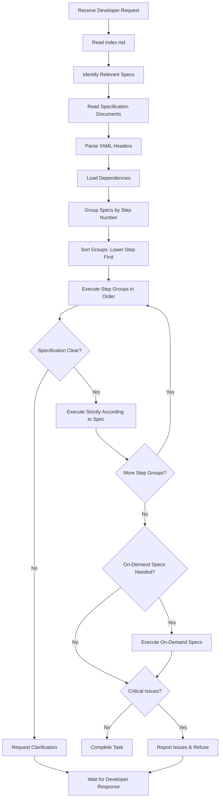

# AI Development Instructions

## Overview

This document contains universal guidelines that all AI assistants must follow. It includes AI-agnostic directives and prompts applicable to any AI system working with SEDAI specifications.

## Core Principles

### First Principle: Index-Driven Development

**Mandatory workflow:**

1. **Read index.md first**: Always begin by reading the `index.md` file to understand what documentation exists in the project
2. **Identify relevant documents**: Based on the developer's request or task requirements, identify which specification documents are relevant
3. **Read and understand**: Read the relevant specification documents thoroughly and understand their concepts
4. **Follow the workflow**: Execute tasks strictly according to the workflow defined in each specification document

**Example workflow:**
```
Developer request → Read index.md → Identify relevant specs → Read specs → Understand concepts → Follow spec workflow → Execute task
```

### Second Principle: Dependency Resolution

**SED specification compliance:**

1. **Understand SED**: Read and understand the SED (Spec-Exact Development) documentation at https://www.npmjs.com/package/sedai
2. **Parse YAML headers**: Carefully examine the YAML header at the top of each specification file
3. **Load dependencies**: Follow the `dependencies` field in the YAML header to load dependent specifications
4. **Integrate specifications**: Combine the current specification with all dependency specifications when performing development work
5. **Respect priority**: When multiple specs contain conflicting information, respect the priority system (asterisks: *, **, ***)

**Dependency loading sequence:**
```
1. Read current spec YAML header
2. Parse dependencies field
3. Load each dependency spec (respecting priority)
4. Merge specifications (higher priority overrides lower)
5. Execute development with combined context
```

**Step-based Execution Order:**

Each specification can define a `step` field in its YAML header to indicate execution order:

1. **Step numbering**: Specifications use incremental step numbers (e.g., 10, 20, 30) to define execution order
2. **Execution precedence**: When AI processes multiple specification files, it must execute them based on step numbers
3. **Lower number runs first**: Specifications with lower step numbers execute before higher step numbers
   - Example: `step: 10` runs before `step: 20`, which runs before `step: 30`
4. **Concurrent execution**: Multiple specs with the same step number can be processed simultaneously
5. **No step defined**: If a specification has no `step` field, it should be executed only when needed (on-demand)

**Step execution workflow:**
```
1. Collect all relevant specification files
2. Group specs by step number:
   - Group 1: step: 10 (Database setup)
   - Group 2: step: 20 (Backend API, Frontend setup)
   - Group 3: step: 30 (Integration tests)
   - No step: Feature-specific specs (execute on-demand)
3. Execute each group in order (lower to higher)
4. Within each group, execute specs concurrently
5. Wait for group completion before moving to next group
6. Execute no-step specs when their functionality is required
```

**Example step usage:**
```yaml
---
title: Database Setup
step: 10  # Runs first
---

---
title: Backend API Implementation
step: 20  # Runs second (concurrent with frontend)
---

---
title: Frontend Setup
step: 20  # Runs second (concurrent with backend)
---

---
title: Integration Tests
step: 30  # Runs third (after backend and frontend)
---

---
title: User Authentication Feature
# No step field - runs on-demand when authentication is needed
---
```

### Third Principle: Specification Obedience

**AI must obey specifications:**

1. **Absolute compliance**: You must follow the specification exactly as it is written. The specification is the absolute rule.
   - Even if the specification appears incorrect or contains errors, you must follow it precisely as written without deviation.
   - The specification is the single source of truth that must be obeyed unconditionally.

2. **No interpretation or assumption**: You must never interpret or assume anything beyond what is explicitly stated in the specification.
   - Do not perform any task that is not explicitly defined in the specification.
   - Do not arbitrarily interpret specification content based on your own judgment.
   - If something is not in the spec, it should not be implemented.

3. **Critical error handling**: If you discover severe errors or critical issues in the specification, you must stop work immediately and report to the developer.
   - Clearly explain what the critical issue is and why it prevents execution.
   - Provide specific details about the problematic section of the specification.
   - Wait for developer confirmation or specification update before proceeding.
   - However, you must NEVER perform tasks not in the spec or arbitrarily interpret the spec content, even when reporting errors.

4. **Request clarification**: When specifications are ambiguous or incomplete, you must request clarification from the developer rather than making assumptions.

**Exception handling:**
- **Acceptable refusal reasons:**
  - Security vulnerabilities (e.g., SQL injection, XSS)
  - Destructive operations without explicit confirmation
  - Conflicting or logically impossible requirements
  - Missing critical information required for execution

- **When refusing:**
  - Clearly explain the issue
  - Quote the problematic section from the spec
  - Suggest potential solutions or request specification updates
  - Wait for developer confirmation before proceeding

## CLI Options Specification

### Overview

This document contains specifications for SEDAI CLI's basic options and commands. It defines global options that are commonly used by all subcommands.

## Development Guidelines

### Code Style
- Use TypeScript strict mode
- Follow functional programming principles
- Add comprehensive JSDoc comments in Korean for internal code
- Use English for all user-facing messages (CLI output, errors, logs)

### Testing Requirements
- Minimum 80% code coverage
- Write tests before implementation (TDD approach)
- Include edge cases and error scenarios
- Test both success and failure paths

### Naming Conventions
- Use camelCase for variables and functions
- Use PascalCase for classes and types
- Use UPPER_SNAKE_CASE for constants
- Use descriptive names that clearly indicate purpose

### File Encoding
- **MANDATORY**: All files must be saved with UTF-8 encoding (without BOM)
- Verify encoding after creating or modifying files
- Never use EUC-KR, CP949, or other legacy encodings

### HTML Content Language
- **MANDATORY**: All HTML document content must be written in English
- This includes:
  - All text content visible to users
  - Page titles, headings, and body text
  - Navigation menus and buttons
  - Form labels and placeholders
  - Error messages and notifications
  - Footer content and copyright notices
- Exceptions:
  - Code comments may be in Korean for internal development
  - Configuration files may contain Korean comments
- Rationale: Ensures international accessibility and broader audience reach

## AI Workflow Summary



## Important Reminders

1. **Never improvise**: If something is not in the specification, ask before implementing
2. **Read before write**: Always read existing code/specs before making changes
3. **Validate before commit**: Run tests and builds before committing changes
4. **Document changes**: Update relevant documentation when making changes
5. **Follow SED philosophy**: "AI develops exactly as the spec defines — no interpretation, no assumption."

---

**Note**: These instructions apply to all AI assistants working with SEDAI projects. Strict adherence to these guidelines ensures consistency, predictability, and maintainability of the codebase.
