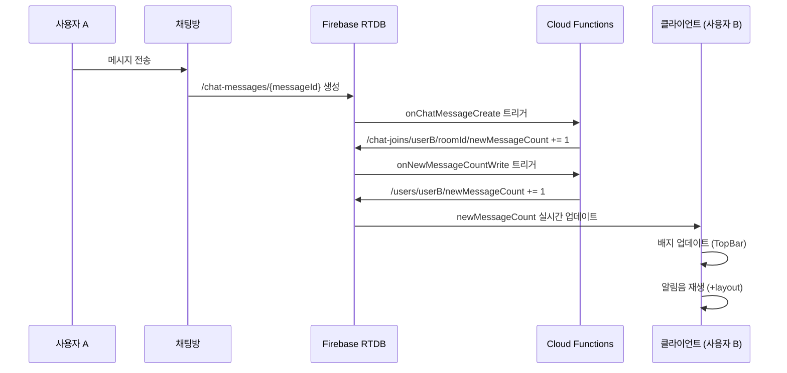
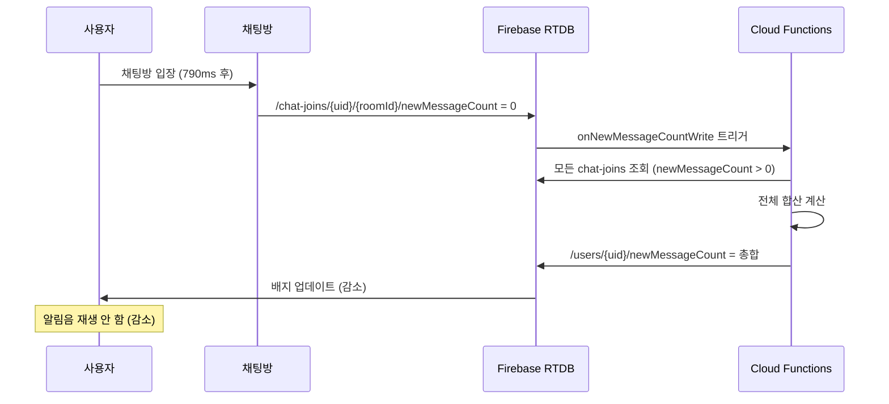

# 채팅 새 메시지 알림 시스템 (Chat Notification & Sound)

## 1. 개요

### 1.1 목적

사용자가 읽지 않은 채팅 메시지 수를 실시간으로 확인하고 새 메시지 도착 시 알림음을 재생하는 시스템을 제공합니다.

### 1.2 주요 기능

- ✅ **전체 채팅방 newMessageCount 합계**: 모든 채팅방의 읽지 않은 메시지 수를 `/users/{uid}/newMessageCount`에 누적
- ✅ **TopBar 알림 배지**: 사용자 프로필 사진에 빨간 배지로 새 메시지 수 표시
- ✅ **실시간 업데이트**: rtdbStore로 `/users/{uid}/newMessageCount` 실시간 구독
- ✅ **알림음 재생**: 새 메시지 수가 증가할 때만 알림음 재생 (감소 시 재생 안 함)
- ✅ **다중 탭 중복 방지**: BroadcastChannel로 여러 탭에서 동시 재생 방지
- ✅ **채팅방 페이지 예외 처리**: 채팅방에 있을 때는 알림음 재생 안 함
- ✅ **디바운스 처리**: 최소 500ms 간격으로 알림음 재생

### 1.3 구현 범위

**백엔드 (Firebase Cloud Functions):**
- `/chat-joins/{uid}/{roomId}/newMessageCount` 변경 감지 트리거
- 증가 시: `/users/{uid}/newMessageCount`를 `increment()`
- 0/삭제 시: 모든 채팅방의 `newMessageCount > 0`인 값만 합산하여 저장

**프론트엔드 (Svelte):**
- TopBar에 알림 배지 표시
- 전역 레이아웃에서 알림음 재생
- BroadcastChannel로 다중 탭 처리

---

## 2. 설계 결정 및 이유

### 2.1 newMessageCount 합산 방식: Cloud Functions vs 클라이언트

**결정:** Cloud Functions에서 `/users/{uid}/newMessageCount` 합계 관리

**이유:**
1. **성능 최적화**: 클라이언트가 모든 채팅방 데이터를 구독할 필요 없음
2. **데이터 일관성**: 서버에서 중앙 관리로 데이터 불일치 방지
3. **네트워크 비용 절감**: RTDB 읽기 횟수 최소화
4. **정확성**: increment와 전체 재계산 혼용으로 예기치 못한 오류 방지

**트레이드오프:**
- 장점: 클라이언트 로직 단순화, 정확한 카운트 유지
- 단점: Cloud Functions 실행 비용 발생 (미미함)

### 2.2 증가 시 increment vs 전체 재계산

**결정:** 증가 시에는 `increment()`, 0/삭제 시에는 전체 재계산

**이유:**

**증가 시 (newMessageCount 1씩 증가):**
- `transaction()` + `increment`로 빠르게 처리
- 각 채팅방에서 메시지가 올 때마다 즉시 반영
- 예: 채팅방 A에서 +1 → `/users/{uid}/newMessageCount` +1

**0/삭제 시 (사용자가 채팅방 읽음 처리):**
- ⚠️ **중요**: `increment`가 아닌 **전체 재계산** 수행
- 모든 `/chat-joins/{uid}/*`에서 `newMessageCount > 0`인 채팅방만 가져와 합산
- 이유: 예기치 못한 상황에서 데이터 불일치 발생 시 자동 복구
- 예:
  - 채팅방 A: 5개, 채팅방 B: 3개 → 합계: 8개
  - 채팅방 A를 읽음 → 채팅방 B의 3개만 합산 → 합계: 3개

**트레이드오프:**
- 장점: 데이터 정확성 보장, 불일치 자동 복구
- 단점: 0으로 변경 시 약간의 추가 RTDB 읽기 발생 (무시할 수준)

### 2.3 알림음 재생 조건: 증가할 때만

**결정:** `newMessageCount`가 증가할 때만 알림음 재생

**이유:**
1. **사용자 경험**: 메시지를 읽어서 카운트가 감소할 때는 알림음 불필요
2. **불필요한 알림 방지**: 5→3으로 감소 시 알림음 재생 안 함
3. **채팅방 예외 처리**: 현재 채팅방에 있으면 알림음 재생 안 함 (이미 메시지 확인 중)

**트레이드오프:**
- 장점: 자연스러운 UX, 불필요한 알림 방지
- 단점: 없음

### 2.4 다중 탭 처리: BroadcastChannel

**결정:** BroadcastChannel API 사용하여 다중 탭에서 중복 재생 방지

**이유:**
1. **사용자 경험**: 같은 브라우저의 여러 탭에서 동시에 알림음이 재생되면 시끄러움
2. **브라우저 API 활용**: 별도 서버 통신 없이 탭 간 메시지 공유
3. **실시간 동기화**: 한 탭에서 알림음 재생 시 다른 탭은 즉시 스킵

**트레이드오프:**
- 장점: 깔끔한 UX, 서버 비용 없음
- 단점: 브라우저 지원 필요 (현대 브라우저는 모두 지원)

---

## 3. 데이터 구조

### 3.1 RTDB 경로

**기존 경로 (채팅방별):**
```
/chat-joins/{uid}/{roomId}/newMessageCount: number
```

**새로운 경로 (전체 합계):**
```
/users/{uid}/newMessageCount: number
```

**예시:**
```
/chat-joins/user123/room-abc/newMessageCount: 5
/chat-joins/user123/room-def/newMessageCount: 3
/users/user123/newMessageCount: 8  ← Cloud Functions가 자동 관리
```

### 3.2 Cloud Functions 트리거

**트리거 경로:**
```typescript
/chat-joins/{uid}/{roomId}/newMessageCount
```

**트리거 이벤트:** `onValueWritten` (생성, 수정, 삭제 모두 감지)

**핸들러 로직:**
```typescript
export async function handleNewMessageCountWritten(
  uid: string,
  roomId: string,
  beforeValue: number | null,
  afterValue: number | null
): Promise<void> {
  const before = Number(beforeValue ?? 0);
  const after = Number(afterValue ?? 0);

  // 1단계: 증가 감지 → increment
  if (after > before) {
    const increment = after - before;
    await admin.database().ref(`users/${uid}/newMessageCount`).transaction(
      (current) => (current || 0) + increment
    );
  }

  // 2단계: 0/삭제 감지 → 전체 재계산
  if (after === 0 || afterValue === null) {
    const snapshot = await admin.database()
      .ref(`chat-joins/${uid}`)
      .orderByChild('newMessageCount')
      .startAt(1)  // newMessageCount >= 1인 채팅방만
      .once('value');

    let total = 0;
    if (snapshot.exists()) {
      const data = snapshot.val();
      for (const roomKey in data) {
        const count = Number(data[roomKey].newMessageCount ?? 0);
        if (count > 0) total += count;
      }
    }

    await admin.database().ref(`users/${uid}/newMessageCount`).set(total);
  }

  // 3단계: 기존 order 필드 업데이트 (0이 되는 경우만)
  // ... (생략, 기존 로직 유지)
}
```

---

## 4. 구현 상세

### 4.1 Cloud Functions 구현

**파일:** `firebase/functions/src/handlers/chat.new-message.handler.ts`

**주요 함수:**
- `handleNewMessageCountWritten()`: newMessageCount 변경 시 비즈니스 로직 처리

**코드 위치:**
- Lines 30-155: 핸들러 함수 전체
- Lines 49-86: 증가 감지 및 increment 로직
- Lines 91-142: 0/삭제 감지 및 전체 재계산 로직
- Lines 147-155: 기존 order 필드 업데이트 로직

**트리거 등록:**
- `firebase/functions/src/index.ts` Lines 641-662

### 4.2 TopBar 알림 배지 구현

**파일:** `src/lib/components/top-bar.svelte`

**주요 기능:**
1. `/users/{uid}/newMessageCount` 실시간 구독
2. 사용자 프로필 사진에 빨간 배지 오버레이
3. 배지에 숫자 표시 (0이면 숨김, 99+는 "99+"로 표시)
4. 펄스 애니메이션으로 시각적 피드백

**코드 위치:**
- Lines 26-49: rtdbStore 구독 및 데이터 추출
- Lines 167-183: 아바타 컨테이너 + 배지 UI
- Lines 225-252: 배지 스타일 (Tailwind CSS + keyframes)

**주요 로직:**
```typescript
// 로그인 시 자동 구독
$effect(() => {
  if (authStore.isAuthenticated && authStore.user?.uid) {
    const path = `users/${authStore.user.uid}/newMessageCount`;
    newMessageCountStore = rtdbStore<number>(rtdb, path);
  } else {
    newMessageCountStore = null;
  }
});

// 새 메시지 개수 추출
let newMessageCount = $derived.by(() => {
  if (!newMessageCountStore) return 0;
  const count = newMessageCountStore.data ?? 0;
  return typeof count === 'number' ? count : 0;
});
```

**배지 UI:**
```svelte
{#if newMessageCount > 0}
  <div class="new-message-badge">
    <span class="new-message-count">
      {newMessageCount > 99 ? '99+' : newMessageCount}
    </span>
  </div>
{/if}
```

### 4.3 전역 알림음 시스템 구현

**파일:** `src/routes/+layout.svelte`

**주요 기능:**
1. `/users/{uid}/newMessageCount` 실시간 구독
2. 증가 감지 시 알림음 재생
3. 채팅방 페이지에서는 재생 안 함
4. 디바운스 처리 (500ms 최소 간격)
5. BroadcastChannel로 다중 탭 중복 방지

**코드 위치:**
- Lines 49-84: rtdbStore 구독 및 상태 관리
- Lines 89-127: newMessageCount 증가 감지 및 알림음 재생
- Lines 132-152: 알림음 재생 함수
- Lines 179-216: Audio 객체 및 BroadcastChannel 초기화

**주요 로직:**

**1) 증가 감지:**
```typescript
let previousCount = $state(0);

$effect(() => {
  const count = newMessageCountStore.data ?? 0;

  // 증가 감지
  if (count > previousCount && previousCount >= 0) {
    // 채팅방에 있으면 알림음 재생 안 함
    if (isChatRoom) {
      previousCount = count;
      return;
    }

    // 디바운스 체크 (최소 500ms 간격)
    const now = Date.now();
    if (now - lastSoundPlayedAt < 500) {
      previousCount = count;
      return;
    }

    // 다른 탭에 알림음 재생 시작 알림
    if (broadcastChannel) {
      broadcastChannel.postMessage({
        type: 'notification-sound-playing',
        timestamp: now
      });
    }

    playNotificationSound();
    lastSoundPlayedAt = now;
  }

  previousCount = count;
});
```

**2) 알림음 재생:**
```typescript
function playNotificationSound() {
  try {
    if (!notificationAudio) return;

    notificationAudio.currentTime = 0;
    notificationAudio.play()
      .then(() => console.log('🔊 [알림음] 재생 성공'))
      .catch((error) => console.warn('🔇 [알림음] 재생 실패:', error));
  } catch (error) {
    console.error('🔇 [알림음] 재생 에러:', error);
  }
}
```

**3) BroadcastChannel 초기화:**
```typescript
onMount(async () => {
  // Audio 객체 초기화
  notificationAudio = new Audio('/sound/new-message.mp3');
  notificationAudio.volume = 0.7;

  // BroadcastChannel 초기화
  if ('BroadcastChannel' in window) {
    broadcastChannel = new BroadcastChannel('sonub-notifications');

    broadcastChannel.onmessage = (event) => {
      if (event.data?.type === 'notification-sound-playing') {
        const timestamp = event.data.timestamp;
        if (Date.now() - timestamp < 500) {
          console.log('🔇 [알림음] 다른 탭에서 재생 중 - 스킵');
          lastSoundPlayedAt = timestamp;
        }
      }
    };
  }

  // Cleanup
  return () => {
    if (broadcastChannel) broadcastChannel.close();
  };
});
```

### 4.4 알림음 파일

**파일 경로:** `/static/sound/new-message.mp3`

**사용 방법:**
```typescript
const audio = new Audio('/sound/new-message.mp3');
audio.volume = 0.7;  // 볼륨 70%
audio.play();
```

---

## 5. 워크플로우

### 5.1 새 메시지 수신 시 전체 흐름



### 5.2 채팅방 읽음 처리 시 전체 흐름



---

## 6. 테스트 시나리오

### 6.1 기본 시나리오

**시나리오 1: 새 메시지 수신**
1. 사용자 A가 로그인
2. 사용자 B가 사용자 A에게 메시지 전송
3. ✅ `/chat-joins/userA/roomId/newMessageCount`: 0 → 1
4. ✅ `/users/userA/newMessageCount`: 0 → 1
5. ✅ TopBar 배지에 "1" 표시
6. ✅ 알림음 재생

**시나리오 2: 여러 채팅방에서 메시지 수신**
1. 사용자 A가 로그인
2. 채팅방 1에서 메시지 2개 수신
3. 채팅방 2에서 메시지 3개 수신
4. ✅ `/users/userA/newMessageCount`: 0 → 2 → 5
5. ✅ TopBar 배지에 "5" 표시
6. ✅ 알림음 2회 재생 (500ms 간격으로)

**시나리오 3: 채팅방 읽음 처리**
1. 사용자 A가 로그인 (newMessageCount = 5)
2. 채팅방 1 입장 (newMessageCount = 2)
3. ✅ `/chat-joins/userA/room1/newMessageCount`: 2 → 0
4. ✅ `/users/userA/newMessageCount`: 5 → 3 (전체 재계산)
5. ✅ TopBar 배지에 "3" 표시
6. ✅ 알림음 재생 안 함 (감소)

### 6.2 에지 케이스

**시나리오 4: 채팅방에 있을 때 메시지 수신**
1. 사용자 A가 채팅방 1에 입장
2. 사용자 B가 채팅방 1에 메시지 전송
3. ✅ `/chat-joins/userA/room1/newMessageCount`: 0 → 1 → 0 (790ms 후)
4. ✅ `/users/userA/newMessageCount`: 0 → 1 → 0
5. ✅ 알림음 재생 안 함 (채팅방 페이지)

**시나리오 5: 다중 탭에서 메시지 수신**
1. 사용자 A가 탭 1과 탭 2에서 로그인
2. 사용자 B가 메시지 전송
3. ✅ `/users/userA/newMessageCount`: 0 → 1
4. ✅ 탭 1에서 알림음 재생
5. ✅ 탭 2에서 알림음 재생 안 함 (BroadcastChannel)

**시나리오 6: 빠른 연속 메시지 수신**
1. 사용자 A가 로그인
2. 사용자 B가 100ms 간격으로 메시지 5개 전송
3. ✅ `/users/userA/newMessageCount`: 0 → 1 → 2 → 3 → 4 → 5
4. ✅ 알림음 재생 1-2회 (디바운스 500ms)

**시나리오 7: 데이터 불일치 복구**
1. 예기치 못한 에러로 `/users/userA/newMessageCount` = 10 (실제: 5)
2. 사용자 A가 채팅방 1 읽음 처리
3. ✅ Cloud Functions가 전체 재계산
4. ✅ `/users/userA/newMessageCount`: 10 → 3 (정확한 값)

### 6.3 브라우저 호환성 테스트

**BroadcastChannel 지원:**
- ✅ Chrome, Edge, Firefox, Safari (2021+)
- ❌ IE 11 (미지원, graceful degradation)

**Audio 자동 재생:**
- ⚠️ 사용자 인터랙션 후 재생 가능
- ✅ 로그인/클릭 후 정상 작동 확인

---

## 7. 성능 고려사항

### 7.1 Cloud Functions 비용

**트리거 발생 빈도:**
- 메시지 1개당 트리거 1회 (증가 시)
- 채팅방 읽음 처리 시 트리거 1회 (0으로 변경)

**예상 비용 (월 100만 메시지 기준):**
- 트리거 실행: 100만 회
- 예상 비용: $0.40 (무료 할당량 200만 회 초과 시)
- 결론: **무시할 수준의 비용**

### 7.2 RTDB 읽기/쓰기

**증가 시:**
- RTDB 쓰기 1회: `/users/{uid}/newMessageCount` update

**0/삭제 시:**
- RTDB 읽기 1회: `/chat-joins/{uid}` 전체 조회 (필터링)
- RTDB 쓰기 1회: `/users/{uid}/newMessageCount` update

**최적화:**
- `orderByChild('newMessageCount').startAt(1)`: 0인 채팅방 제외로 읽기 최소화

### 7.3 클라이언트 성능

**rtdbStore 구독:**
- 1개 경로만 구독: `/users/{uid}/newMessageCount`
- 메모리 사용량: 최소 (숫자 1개)
- 네트워크 트래픽: 거의 없음 (값 변경 시에만 업데이트)

**알림음 재생:**
- 메모리: Audio 객체 1개 (약 1MB)
- CPU: 재생 시에만 사용

---

## 8. 보안 고려사항

### 8.1 RTDB 보안 규칙

**필수 규칙:**
```json
{
  "rules": {
    "users": {
      "$uid": {
        "newMessageCount": {
          ".read": "$uid === auth.uid",
          ".write": false  // Cloud Functions만 쓰기 가능
        }
      }
    }
  }
}
```

**이유:**
- 읽기: 본인만 확인 가능
- 쓰기: Cloud Functions만 가능 (클라이언트 조작 방지)

### 8.2 XSS 방지

**배지 숫자 표시:**
```svelte
{newMessageCount > 99 ? '99+' : newMessageCount}
```

**이유:**
- 숫자만 표시하므로 XSS 위험 없음
- HTML 태그 삽입 불가능

---

## 9. 향후 개선 사항

### 9.1 알림음 커스터마이징
- [ ] 사용자가 알림음을 선택할 수 있는 설정 페이지
- [ ] 알림음 볼륨 조절 기능

### 9.2 알림 설정
- [ ] 알림음 켜기/끄기 토글
- [ ] 특정 시간대 알림 음소거 (예: 22:00-08:00)
- [ ] 특정 채팅방 알림 음소거

### 9.3 고급 알림
- [ ] 브라우저 푸시 알림 통합 (Notification API)
- [ ] 배지 클릭 시 채팅 목록 페이지로 이동
- [ ] 알림 센터 UI (알림 이력 표시)

---

## 10. 변경 이력

### v1.0.0 (2025-01-14)
- [x] ✅ Cloud Functions `handleNewMessageCountWritten()` 구현
- [x] ✅ 증가 시 `/users/{uid}/newMessageCount` increment
- [x] ✅ 0/삭제 시 전체 채팅방 newMessageCount 합산 및 재계산
- [x] ✅ TopBar에 알림 배지 UI 추가
- [x] ✅ `/users/{uid}/newMessageCount` rtdbStore 구독
- [x] ✅ 빨간 배지 + 펄스 애니메이션
- [x] ✅ 99+ 표시 (100개 이상 시)
- [x] ✅ +layout.svelte에 전역 알림음 시스템 구현
- [x] ✅ newMessageCount 증가 감지 (이전 값과 비교)
- [x] ✅ 증가 시에만 알림음 재생 (감소 시 재생 안 함)
- [x] ✅ 채팅방 페이지에서 알림음 재생 안 함
- [x] ✅ 디바운스 처리 (500ms 최소 간격)
- [x] ✅ BroadcastChannel로 다중 탭 중복 재생 방지
- [x] ✅ Audio 객체 초기화 (볼륨 70%)
- [x] ✅ 사용자 인터랙션 후 알림음 재생 가능 (브라우저 정책)
- [x] ✅ SED 스펙 문서 작성

---

## 11. 참고 문서

- [Firebase Cloud Functions 공식 문서](https://firebase.google.com/docs/functions)
- [Firebase RTDB 보안 규칙](https://firebase.google.com/docs/database/security)
- [BroadcastChannel API](https://developer.mozilla.org/en-US/docs/Web/API/BroadcastChannel)
- [Web Audio API](https://developer.mozilla.org/en-US/docs/Web/API/Web_Audio_API)
- [Svelte 5 Runes](https://svelte.dev/docs/svelte/$effect)
