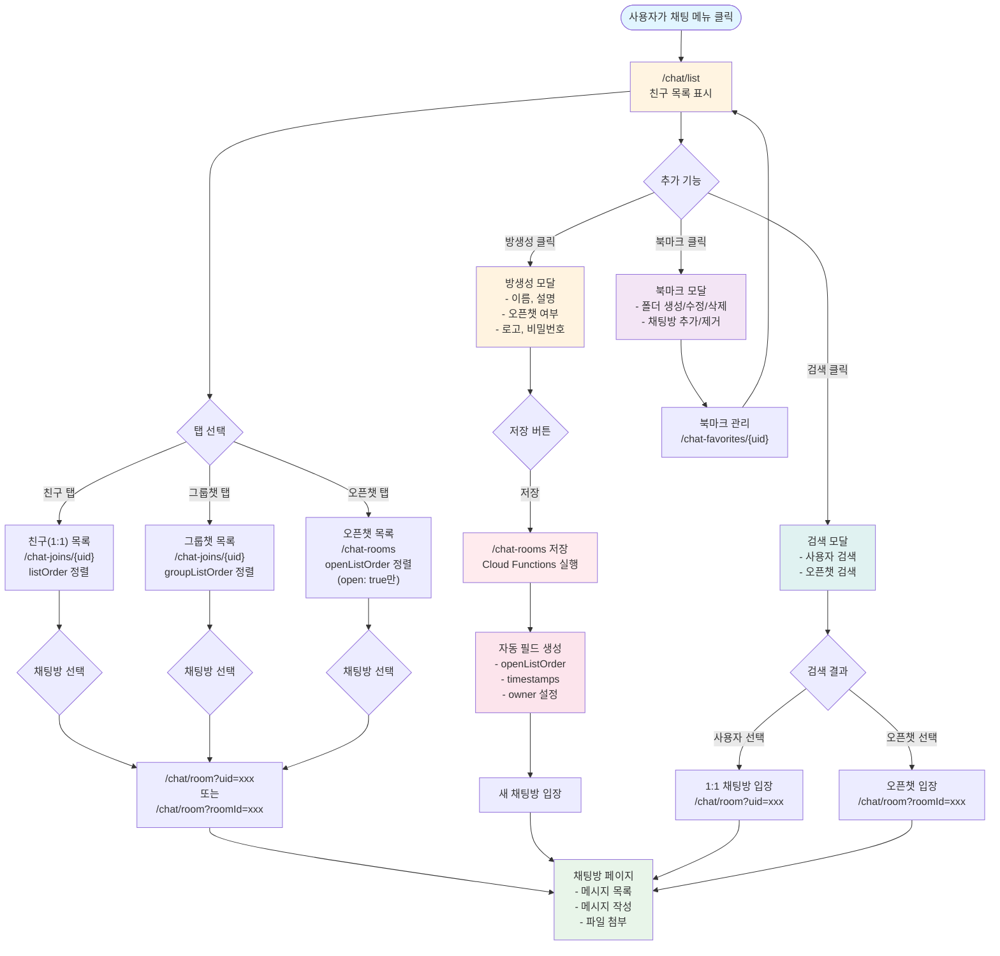

- [채팅 및 게시판 통합 시스템 개요](#채팅-및-게시판-통합-시스템-개요)
  - [워크플로우](#워크플로우)
    - [📋 문서의 범위](#-문서의-범위)
    - [🎯 핵심 설계 개념](#-핵심-설계-개념)
    - [클라이언트와 백엔드의 역할 분리](#클라이언트와-백엔드의-역할-분리)
  - [개요](#개요)
  - [채팅방 시스템](#채팅방-시스템)
    - [채팅방 타입](#채팅방-타입)
    - [권한 관리 (Role)](#권한-관리-role)
    - [서브 채팅방 구조](#서브-채팅방-구조)
  - [채팅방 순서도](#채팅방-순서도)
    - [채팅 UI 흐름 개요](#채팅-ui-흐름-개요)
    - [채팅방 목록 페이지 구조](#채팅방-목록-페이지-구조)
    - [채팅방 목록 조회 방식](#채팅방-목록-조회-방식)
    - [채팅방 입장](#채팅방-입장)
    - [방생성 기능](#방생성-기능)
    - [북마크(즐겨찾기) 기능](#북마크즐겨찾기-기능)
    - [검색 기능](#검색-기능)
    - [전체 흐름도 (Mermaid)](#전체-흐름도-mermaid)
    - [데이터 흐름 요약](#데이터-흐름-요약)
  - [메시지 시스템](#메시지-시스템)
    - [메시지 타입](#메시지-타입)
    - [메시지 저장 구조](#메시지-저장-구조)
    - [메시지 Order 필드](#메시지-order-필드)
    - [메시지 생명주기](#메시지-생명주기)
  - [게시판 통합](#게시판-통합)
    - [게시판과 채팅의 통합 방식](#게시판과-채팅의-통합-방식)
    - [게시판 조회 전략](#게시판-조회-전략)
  - [설계 원칙](#설계-원칙)
    - [1. Flat Style 구조](#1-flat-style-구조)
    - [2. Order 필드 기반 정렬](#2-order-필드-기반-정렬)
    - [3. 최소 정보 저장](#3-최소-정보-저장)
    - [4. Cloud Functions 활용](#4-cloud-functions-활용)
  - [향후 개발 항목](#향후-개발-항목)
  - [관련 가이드 문서](#관련-가이드-문서)
  - [참고 자료](#참고-자료)

---

## 워크플로우

### 📋 문서의 범위

본 문서는 **채팅 및 게시판 통합 시스템의 아키텍처와 데이터 구조 개요**를 제공합니다.

- ✅ **포함되는 내용**:
  - 채팅방 타입과 특징
  - 메시지 저장 구조 및 필드 정의
  - 게시판 통합 메커니즘
  - 서브 채팅방 기능과 제약사항
  - 권한 관리 (owner, moderator, member)
  - Order 필드의 역할과 쿼리 전략

- ❌ **포함되지 않는 내용**:
  - 구체적인 구현 코드 예제
  - 상세한 UI/UX 가이드
  - Cloud Functions 구현 상세

**Firebase 데이터베이스 구조는** [sonub-firebase-database.md](./sonub-firebase-database.md)를 참고하세요.

### 🎯 핵심 설계 개념

1. **채팅 = 게시판**: 일반 메시지와 게시글이 동일한 채팅방에 함께 저장됨
2. **Flat 구조**: 모든 메시지는 `/chat-messages/{messageId}` 형태로 1단계 깊이로만 저장
3. **Order 기반 정렬**: Firebase RTDB의 제한된 쿼리 능력을 보완하기 위해 다양한 order 필드 사용
4. **계층적 채팅방**: 부모 채팅방 아래에 서브 채팅방을 구성 가능 (최대 2단계)
5. **최소 정보 저장**: 클라이언트는 기본 정보만 저장, 추가 처리는 Cloud Functions에서 처리

### 클라이언트와 백엔드의 역할 분리

**클라이언트의 역할:**
- ✅ 메시지 기본 정보만 저장 (text, urls, type, senderUid, timestamps)
- ✅ 사용자가 직접 입력한 데이터 (게시글 제목, 내용 등)
- ❌ 사용자 정보 (displayName, photoUrl) 저장 금지
- ❌ 추가 메타데이터 자동 생성 금지

**백엔드(Cloud Functions)의 역할:**
- ✅ Order 필드 자동 생성
- ✅ 타임스탬프 기반 데이터 검증
- ✅ 메시지 관련 부가 정보 생성
- ✅ 채팅방 통계 및 메타데이터 관리

---

## 개요

Sonub의 채팅 시스템은 **일반 메시징과 게시판 기능을 통합**한 혁신적 설계입니다.

사용자는 채팅방에 입장하면:
- **일반 채팅 메시지**로 실시간 대화
- **게시글 형식 메시지**로 구조화된 정보 공유

이 두 가지 형태의 메시지가 동일한 데이터베이스에 함께 저장되며, 조회 방식에 따라 채팅 목록 또는 게시판 목록으로 표시됩니다.

---

## 채팅방 시스템

### 채팅방 타입

#### 1. **1:1 채팅방** (일대일 채팅)
- 두 사용자 간의 비공개 채팅
- 데이터 위치: `/chat-joins/{myUid}/{roomId}`
- **서브 채팅방 미지원**: 1:1 채팅방은 계층 구조가 없음
- 검색 및 목록에 미포함

#### 2. **그룹 채팅방** (Group Chat)
- 초대된 사용자들만 입장 가능한 채팅방
- 데이터 위치: `/chat-rooms/{roomId}`
- 검색이나 채팅방 목록에 **미포함**
- **서브 채팅방 지원**: Owner/Moderator가 서브 채팅방 생성 가능
- 예: 팀 채팅, 프로젝트 그룹

#### 3. **오픈 채팅방** (Open Chat)
- 누구나 입장 가능한 공개 채팅방
- 데이터 위치: `/chat-rooms/{roomId}`
- 검색 및 채팅방 목록에 **포함됨**
- **서브 채팅방 지원**: Owner/Moderator가 서브 채팅방 생성 가능
- 예: 공개 커뮤니티, 공지사항 채팅방

#### 4. **서브 채팅방** (Sub Chat Room)
- 그룹/오픈 채팅방 아래에 연결된 하위 채팅방
- 데이터 위치: `/chat-rooms/{roomId}` (parentRoomId 필드 포함)
- 부모 채팅방의 메시지는 서브 채팅방으로 **전파되지 않음**
- 서브 채팅방의 메시지는 부모 채팅방에서 **모두 표시 가능** (rootOrder 사용)
- 예: 공지사항, 토론방, 질문방
- **제약사항**:
  - 최대 2단계만 지원 (부모 > 자식)
  - 서브 채팅방은 다른 채팅방을 부모로 가질 수 없음
  - 부모 채팅방은 하나만 가능

### 권한 관리 (Role)

#### **Owner** (채팅방 생성자)
- 채팅방 생성 및 삭제 권한
- Moderator 추가/제거 권한
- 멤버 추가/제거 권한
- 서브 채팅방 생성 권한
- 채팅방 정보 수정 권한

#### **Moderator** (관리자)
- Owner에 의해 추가됨
- 멤버 추가/제거 권한
- 서브 채팅방 생성 권한
- 메시지 삭제 권한 (필요시)

#### **Member** (일반 멤버)
- 채팅 메시지 작성 권한
- 게시글 작성 권한
- `/chat-rooms/{roomId}/users` 배열에 UID로 저장

### 서브 채팅방 구조

서브 채팅방은 **완전히 독립된 하나의 채팅방**으로 운영됩니다.

**특징:**
- 각 서브 채팅방은 자체 메시지, 메타데이터, 멤버를 독립적으로 관리
- `/chat-rooms/{subRoomId}/parentRoomId` 필드로 부모 채팅방 추적
- 부모 채팅방에서 하위 채팅방의 메시지를 모두 볼 수 있음 (rootOrder 사용)

**활용 예시:**
```
필리핀 (부모 채팅방)
├── 마닐라 (서브 채팅방)
└── 세부 (서브 채팅방)
```

마닐라와 세부에서 작성되는 메시지는:
- 각 채팅방의 채팅 목록에 표시 (roomOrder 사용)
- 필리핀 부모 채팅방에서도 모두 조회 가능 (rootOrder 사용)

---

## 채팅방 순서도

### 채팅 UI 흐름 개요

사용자가 채팅 기능을 사용하는 전체 흐름은 다음과 같습니다:

1. **진입점**: 사용자가 채팅 메뉴를 클릭하면 `/chat/list` 페이지로 이동
2. **기본 화면**: 친구(1:1 채팅) 목록이 기본으로 표시됨
3. **목록 전환**: 상단 탭을 통해 그룹챗, 오픈챗 목록으로 전환 가능
4. **채팅방 입장**: 목록에서 채팅방을 선택하면 `/chat/room` 페이지로 이동
5. **추가 기능**: 방생성, 북마크, 검색 등의 부가 기능 제공

### 채팅방 목록 페이지 구조

#### 상단 메뉴 구성

채팅 목록 페이지(`/chat/list`) 상단에는 다음과 같은 메뉴가 제공됩니다:

```
[친구] [그룹챗] [오픈챗] _________________ [방생성] [설정⚙️]
                                                   └─ 북마크
                                                   └─ 검색
```

**메뉴 설명:**
- **친구**: 1:1 채팅방 목록 표시
- **그룹챗**: 내가 참여한 그룹 채팅방 목록 표시
- **오픈챗**: 공개된 오픈 채팅방 목록 표시
- **방생성**: 새로운 그룹/오픈 채팅방 생성
- **북마크**: 즐겨찾기한 채팅방 관리
- **검색**: 사용자 또는 채팅방 검색

### 채팅방 목록 조회 방식

#### 1. 친구(1:1 채팅) 목록

**경로:** `/chat/list` (기본)

**데이터 소스:**
- `/chat-joins/{myUid}` 경로에서 조회
- `type: "single"` 또는 `roomType: "single"` 필터링

**정렬 기준:**
- `listOrder` 필드 기준 내림차순 정렬
- 최근 대화한 채팅방이 상단에 표시

**특징:**
- 1:1 채팅방은 검색/공개 목록에 미포함
- 상대방의 프로필 정보(`/users/{partnerUid}`)를 실시간으로 조회하여 표시

#### 2. 그룹챗 목록

**경로:** `/chat/list?tab=group` 또는 `/chat/group-chat-list`

**데이터 소스:**
- `/chat-joins/{myUid}` 경로에서 조회
- 내가 참여한 그룹 채팅방만 표시

**정렬 기준:**
- `groupListOrder` 필드 기준 정렬
- Cloud Functions에서 자동으로 생성 및 관리

**특징:**
- 초대받은 채팅방만 목록에 표시됨
- 검색/공개 목록에 미포함
- 채팅방 이름, 멤버 수, 마지막 메시지 등 표시

#### 3. 오픈챗 목록

**경로:** `/chat/list?tab=open` 또는 `/chat/open-chat-list`

**데이터 소스:**
- `/chat-rooms/` 경로에서 조회
- `open: true` 필드가 설정된 채팅방만 조회

**정렬 기준:**
- `openListOrder` 필드 기준 정렬
- Cloud Functions에서 `open: true`인 경우에만 자동 생성

**특징:**
- 누구나 접근 가능한 공개 채팅방
- 검색 결과에 포함됨
- 채팅방 이름, 설명, 멤버 수, 로고 이미지 표시

**`openListOrder` 필드 생성 규칙:**
```typescript
// Cloud Functions에서 자동 생성
if (chatRoom.open === true) {
  chatRoom.openListOrder = `-${timestamp}`;
}
```

### 채팅방 입장

**모든 채팅방 타입(1:1, 그룹, 오픈)은 동일한 페이지/컴포넌트를 사용합니다.**

**경로 형식:**
- 1:1 채팅: `/chat/room?uid={partnerUid}`
- 그룹/오픈 채팅: `/chat/room?roomId={roomId}`

**공통 기능:**
- 메시지 목록 조회 (`/chat-messages`)
- 실시간 메시지 수신
- 메시지 작성 (일반 메시지 또는 게시글)
- 파일 첨부
- 채팅방 정보 표시

### 방생성 기능

**트리거:** 사용자가 "방생성" 버튼 클릭

**UI:** 모달 다이얼로그 표시

**입력 필드:**
```typescript
{
  name: string;           // 채팅방 이름 (필수)
  description: string;    // 채팅방 설명 (선택)
  open: boolean;          // 오픈챗 여부 (true: 오픈챗, false: 그룹챗)
  logoUrl: string;        // 채팅방 로고 이미지 URL (선택)
  password: string;       // 입장 비밀번호 (선택)
}
```

**동작 흐름:**
1. 사용자가 정보 입력 및 "저장" 버튼 클릭
2. 클라이언트가 `/chat-rooms/{roomId}` 경로에 기본 정보 저장
3. Cloud Functions가 자동으로 추가 필드 생성:
   - `open: true`인 경우 → `openListOrder` 자동 생성
   - `createdAt`, `updatedAt` 타임스탬프 추가
   - 생성자를 `owner`로 설정
4. 생성 완료 후 해당 채팅방으로 자동 입장

**생성되는 데이터 구조:**
```typescript
/chat-rooms/{roomId} {
  name: "새 채팅방",
  description: "채팅방 설명",
  open: true,
  logoUrl: "https://...",
  password: "hashed_password",
  owner: "creatorUid",
  createdAt: 1698473000000,
  openListOrder: "-1698473000000",  // open: true인 경우만
  members: ["creatorUid"]
}
```

### 북마크(즐겨찾기) 기능

**트리거:** 사용자가 "설정 ⚙️" → "북마크" 클릭

**UI:** 모달 다이얼로그 표시

**데이터 구조:**
```typescript
/chat-favorites/{myUid}/{favoriteId} {
  name: "업무 관련",           // 북마크 폴더 이름
  createdAt: 1698473000000,
  roomList: {
    "room-id-a": true,       // 북마크된 채팅방 ID 목록
    "room-id-b": true,
    "room-id-c": true
  }
}
```

**기능:**
- **북마크 폴더 생성**: 새로운 즐겨찾기 카테고리 생성
- **북마크 폴더 수정**: 폴더 이름 변경
- **북마크 폴더 삭제**: 폴더 및 포함된 북마크 삭제
- **채팅방 북마크 추가**: 선택한 폴더에 채팅방 추가
- **채팅방 북마크 제거**: 폴더에서 채팅방 제거
- **북마크 조회**: 폴더별 북마크된 채팅방 목록 표시

**활용 예:**
```
📁 업무 관련
  ├── 개발팀 채팅
  ├── 프로젝트 A
  └── 긴급 공지

📁 친구들
  ├── 대학 동기
  ├── 운동 모임
  └── 게임 파티
```

### 검색 기능

**트리거:** 사용자가 "설정 ⚙️" → "검색" 클릭

**UI:** 재사용 가능한 모달 다이얼로그 컴포넌트

**검색 대상:**
- 사용자 검색 (`/users` 노드)
- 오픈 채팅방 검색 (`/chat-rooms` 노드, `open: true`만)

**검색 기능:**
- 사용자 이름(displayName) 검색
- 사용자 UID 검색
- 채팅방 이름 검색
- 채팅방 설명 검색

**재사용 컴포넌트:**
이 검색 다이얼로그는 다음 페이지에서도 재사용됩니다:
- 관리자 페이지: 사용자 관리
- 사용자 목록 페이지: 빠른 사용자 찾기
- 채팅방 멤버 초대: 초대할 사용자 검색
- 친구 추가: 새로운 친구 찾기

**검색 결과 동작:**
- **사용자 선택 시**: 해당 사용자와의 1:1 채팅방으로 이동
- **오픈챗 선택 시**: 해당 채팅방으로 입장

### 전체 흐름도 (Mermaid)



### 데이터 흐름 요약

#### 채팅방 목록 조회

| 목록 타입 | 데이터 소스 | 정렬 필드 | 필터 조건 |
|----------|-----------|---------|---------|
| 친구(1:1) | `/chat-joins/{myUid}` | `listOrder` | `type: "single"` |
| 그룹챗 | `/chat-joins/{myUid}` | `groupListOrder` | `type: "group"` |
| 오픈챗 | `/chat-rooms` | `openListOrder` | `open: true` |

#### 정렬 필드 생성 주체

| 필드 | 생성 시점 | 생성 주체 | 목적 |
|-----|---------|---------|-----|
| `listOrder` | 메시지 수신 시 | Cloud Functions | 모든 채팅방의 기본 정렬 순서 |
| `groupListOrder` | 그룹챗 입장 시 | Cloud Functions | 그룹챗 목록 정렬 |
| `openListOrder` | 채팅방 생성/수정 시 (`open: true`) | Cloud Functions | 오픈챗 목록 정렬 |

**정렬 값 형식:**
```typescript
listOrder: `-${timestamp}`           // 예: "-1698473000000"
groupListOrder: `-${timestamp}`      // 예: "-1698473000000"
openListOrder: `-${timestamp}`       // 예: "-1698473000000"
```

마이너스(`-`) 접두사를 사용하여 Firebase RTDB에서 최신 항목이 먼저 오도록 정렬합니다.

---

## 메시지 시스템

### 메시지 타입

메시지는 두 가지 타입으로 구분됩니다.

#### **message** (일반 메시지)
- 일반 채팅 메시지
- 기본값
- 구성: `senderUid`, `text`, `urls`, `timestamps`

#### **post** (게시글 형식 메시지)
- 게시판 형식의 구조화된 메시지
- 추가 필드: `category`, `title`, `categoryOrder`
- 채팅 목록과 게시판 목록 모두에 표시
- 예: 공지사항, 질문과 답변, 자유 토론 등

### 메시지 저장 구조

모든 메시지는 `/chat-messages/{messageId}` 경로에 1단계 깊이로만 저장됩니다.

**메시지 기본 필드:**
```typescript
{
  messageId: "고유 메시지 ID",
  senderUid: "작성자 UID",          // 유일한 사용자 정보 필드
  type: "message" | "post",         // 기본값: "message"
  text: "메시지 내용",
  urls: ["https://...", ...],       // 첨부된 URL 배열 (선택)
  createdAt: 1698473000000,         // 메시지 작성 시간
  editedAt: 1698473100000,          // 메시지 수정 시간 (수정된 경우만)
  deletedAt: 1698473200000,         // 메시지 삭제 시간 (삭제된 경우만)

  // Order 필드들 (자동 생성)
  roomOrder: "-roomId-1698473000000",
  rootOrder: "-parentRoomId-1698473000000",
  openOrder: 1698473000000,

  // type: "post"인 경우 추가 필드
  category: "notice",               // 게시판 카테고리
  title: "게시글 제목",
  categoryOrder: "categoryId-1698473000000"
}
```

**⚠️ 저장되지 않는 필드:**
- ❌ `senderName` - `/users/{uid}`에서 실시간 조회
- ❌ `senderPhotoUrl` - `/users/{uid}`에서 실시간 조회
- ❌ 메타데이터 (조회수, 좋아요 등) - Cloud Functions에서 관리

### 메시지 Order 필드

Firebase RTDB의 제한된 쿼리 기능을 보완하기 위해 여러 order 필드를 사용합니다.

#### **roomOrder**
- **용도**: 현재 채팅방에서의 메시지 표시 순서
- **형식**: `"-{roomId}-{timestamp}"`
- **사용 예**: 특정 채팅방의 메시지 목록 조회
- **쿼리**: `roomOrder` 범위 쿼리로 효율적인 페이지네이션

#### **rootOrder**
- **용도**: 부모 채팅방에서 하위 채팅방의 메시지를 포함하여 표시
- **형식**: `"-{parentRoomId}-{timestamp}"`
- **사용 예**: 부모 채팅방이 모든 서브 채팅방의 메시지를 함께 표시
- **특징**: 서브 채팅방의 메시지도 동일한 구조로 저장

#### **openOrder**
- **용도**: 모든 오픈 채팅 메시지를 한 곳에서 조회
- **형식**: `"{timestamp}"`
- **사용 예**: 웹/앱 내 "최신 메시지" 또는 "피드" 기능
- **적용 대상**: 오픈 채팅방의 메시지만

#### **categoryOrder**
- **용도**: 게시판 목록에서 카테고리별 메시지 표시 순서 (type: "post"만)
- **형식**: `"{categoryId}-{timestamp}"`
- **사용 예**: "공지사항" 카테고리 메시지만 조회
- **적용 대상**: type: "post"인 메시지만

### 메시지 생명주기

**메시지는 영구적으로 저장됩니다.**

- 삭제된 메시지: `deletedAt` 필드로 표시만 함 (물리적 삭제 없음)
- 수정된 메시지: `editedAt` 필드로 수정 여부 표시
- 자동 삭제 정책: 없음

---

## 게시판 통합

### 게시판과 채팅의 통합 방식

Sonub의 게시판은 **채팅방 자체에 통합**되어 있습니다. 별도의 게시판 메뉴가 없습니다.

**메시지 작성 시 두 가지 형태:**

1. **일반 채팅 메시지** (type: "message")
   - 빠른 대화를 위한 형식
   - 제목이 없음
   - 채팅 목록에만 표시

2. **게시글 형식 메시지** (type: "post")
   - 모달 다이얼로그를 통해 작성
   - 카테고리 선택, 제목 입력, 내용 입력, 첨부 파일 업로드
   - 채팅 목록과 게시판 목록 모두에 표시

**특징:**
- 게시글과 일반 메시지가 같은 채팅방에 섞여 있음
- 조회 방식에 따라 채팅 목록 또는 게시판 목록으로 구분

### 게시판 조회 전략

#### **채팅 목록**
- 해당 채팅방의 모든 메시지 (type: "message" + type: "post")
- **Order 필드**: `roomOrder` 또는 `rootOrder` 사용
- **표시 순서**: 시간 역순 (최신 메시지 먼저)

#### **게시판 목록 (type: "post"만)**
- 같은 카테고리의 게시글만 필터링
- **Order 필드**: `categoryOrder` 사용
- **표시 순서**: 시간 역순 (최신 게시글 먼저)
- **선택적 필터링**: 채팅방별 또는 채팅방 전체에서 조회 가능

---

## 설계 원칙

### 1. Flat Style 구조

```
모든 메시지:
/chat-messages/{messageId} { ... }

모든 채팅방:
/chat-rooms/{roomId} { ... }
```

- 복잡한 계층 구조 회피
- 단순하고 일관된 데이터 구조
- 쿼리 효율성 극대화

### 2. Order 필드 기반 정렬

Firebase RTDB에서는 다양한 정렬 요구사항을 처리하기 위해 **여러 order 필드를 미리 생성**합니다.

- **roomOrder**: 채팅방별 메시지 정렬
- **rootOrder**: 계층적 채팅방 통합 조회
- **openOrder**: 전역 피드 조회
- **categoryOrder**: 게시판 카테고리별 조회

이 방식으로 단순한 범위 쿼리만으로 복잡한 정렬 요구사항을 처리할 수 있습니다.

### 3. 최소 정보 저장

클라이언트는 **메시지 작성 시 필수 정보만** RTDB에 저장합니다.

**저장하는 정보:**
- `senderUid`: 작성자의 UID만 저장
- `text`: 메시지 내용
- `urls`: 첨부 URL
- `type`: message 또는 post
- 게시글의 경우: category, title

**저장하지 않는 정보:**
- `senderName`, `senderPhotoUrl`: `/users/{senderUid}`에서 실시간 조회
- 추가 메타데이터: Cloud Functions에서 생성

### 4. Cloud Functions 활용

메시지 작성 후 처리는 **모두 Cloud Functions에서 수행**합니다.

**Cloud Functions 역할:**
- Order 필드 자동 생성 (roomOrder, rootOrder, openOrder, categoryOrder)
- 타임스탐프 유효성 검증
- 메시지 관련 통계 및 메타데이터 관리
- 채팅방 정보 자동 업데이트

---

## 향후 개발 항목

### **알림 (Notification) 시스템**
- 새 메시지 알림 규칙 정의 필요
- 멘션(@) 기능 여부 검토 필요
- 읽음/안 읽음 상태 추적 방식 정의 필요

---

## 관련 가이드 문서

**데이터베이스 구조 상세:**
- [Firebase Realtime Database 구조 가이드](./sonub-firebase-database.md) - `/chat-rooms`, `/chat-messages`, `/chat-joins` 노드 상세 정의

**구현 가이드 (향후 작성 예정):**
- 채팅 UI/UX 개발 가이드
- 메시지 작성 및 조회 API
- Cloud Functions 구현 상세

---

## 참고 자료

- [Firebase Realtime Database 공식 문서](https://firebase.google.com/docs/database)
- [Firebase Security Rules 공식 문서](https://firebase.google.com/docs/rules)
- [Firebase Cloud Functions 공식 문서](https://firebase.google.com/docs/functions)

---

**마지막 업데이트**: 2025-11-12
**SED 준수**: 엄격 모드, UTF-8 인코딩, 명시적 정의

## 작업 이력 (SED Log)

| 날짜 | 작업자 | 내용 |
| ---- | ------ | ---- |
| 2025-11-10 | Codex Agent | `/chat/room` 페이지 초안을 구현하여 GET uid 기반 1:1 채팅 진입, 상대 프로필 실시간 표시, `/chat-messages` 노드 리스트 조회(DatabaseListView) 및 기본 입력 UI 구성을 완료함. |
| 2025-11-12 | Claude Sonnet 4.5 | "채팅방 순서도" 섹션 추가: 채팅 UI 흐름, 채팅방 목록 조회 방식(친구/그룹챗/오픈챗), 방생성, 북마크, 검색 기능에 대한 상세한 설명과 Mermaid 플로우차트 작성. 각 기능의 데이터 소스, 정렬 필드, 경로 구조를 명시하고 전체 사용자 흐름을 시각화함. |
