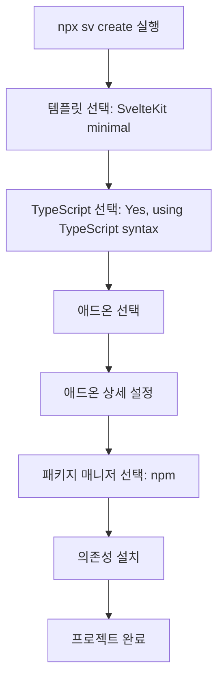

# SvelteKit 프로젝트 초기 설정 명세서

## 1. 개요

본 명세서는 Sonub 프로젝트의 SvelteKit 개발 환경을 구축하기 위한 완전한 설치 및 설정 절차를 정의합니다. 이 명세서에 따라 AI는 정확히 명시된 버전과 설정으로 SvelteKit 프로젝트를 구성해야 합니다.

### 1.1 목적

- Svelte 5.41.0 이상 버전을 사용하는 SvelteKit 프로젝트 초기화
- TypeScript, Tailwind CSS, Vitest, Playwright 등 필수 도구 설치
- 국제화(i18n), Storybook, MCP 등 고급 기능 설정
- 일관된 개발 환경 보장

### 1.2 범위

- SvelteKit 프로젝트 생성 (CLI 기반)
- 모든 의존성 패키지 설치
- 개발 도구 및 플러그인 설정
- 프로젝트 구조 확립

## 2. 요구사항

### 2.1 시스템 요구사항

**필수 소프트웨어:**
- Node.js: v18.0.0 이상 (권장: v20 LTS)
- npm: v9.0.0 이상 (또는 pnpm, yarn)
- Git: v2.30.0 이상

**운영 체제:**
- macOS, Linux, Windows (WSL2 권장)

**디스크 공간:**
- 최소 500MB 여유 공간

### 2.2 기능 요구사항

**핵심 프레임워크:**
- Svelte: 5.41.0 이상 (정확한 버전: ^5.41.0)
- SvelteKit: 2.47.1 이상 (정확한 버전: ^2.47.1)
- Vite: 7.1.10 이상 (정확한 버전: ^7.1.10)

**개발 언어:**
- TypeScript: 5.9.3 이상 (정확한 버전: ^5.9.3)

**필수 애드온:**
- Prettier: 코드 포맷터
- ESLint: 린터
- Vitest: 단위 테스트 및 컴포넌트 테스트
- Playwright: 브라우저 자동화 테스트
- Tailwind CSS: CSS 프레임워크
- SvelteKit Adapter (Node): 배포 어댑터
- MDsveX: Markdown + Svelte
- Paraglide: 국제화(i18n)
- Storybook: 컴포넌트 개발 환경
- MCP (Svelte MCP): Model Context Protocol

## 3. 설치 환경

### 3.1 프로젝트 정보

```yaml
프로젝트명: sonub
디렉토리: ./sonub
템플릿: SvelteKit minimal
타입 체킹: TypeScript syntax
패키지 매니저: npm
```

### 3.2 설치할 패키지 버전

아래 버전은 package.json에 정의된 정확한 버전입니다.

**핵심 프레임워크:**
```json
{
  "svelte": "^5.41.0",
  "@sveltejs/kit": "^2.47.1",
  "@sveltejs/vite-plugin-svelte": "^6.2.1",
  "@sveltejs/adapter-node": "^5.4.0",
  "vite": "^7.1.10"
}
```

**TypeScript:**
```json
{
  "typescript": "^5.9.3",
  "typescript-eslint": "^8.46.1",
  "svelte-check": "^4.3.3"
}
```

**코드 품질 도구:**
```json
{
  "prettier": "^3.6.2",
  "prettier-plugin-svelte": "^3.4.0",
  "prettier-plugin-tailwindcss": "^0.7.1",
  "eslint": "^9.38.0",
  "eslint-config-prettier": "^10.1.8",
  "eslint-plugin-svelte": "^3.12.4",
  "@eslint/js": "^9.38.0",
  "@eslint/compat": "^1.4.0"
}
```

**테스트 도구:**
```json
{
  "vitest": "^4.0.5",
  "vitest-browser-svelte": "^2.0.1",
  "@vitest/browser-playwright": "^4.0.5",
  "playwright": "^1.56.1",
  "@playwright/test": "^1.56.1"
}
```

**CSS 프레임워크:**
```json
{
  "tailwindcss": "^4.1.14",
  "@tailwindcss/vite": "^4.1.14",
  "@tailwindcss/typography": "^0.5.19",
  "@tailwindcss/forms": "^0.5.10"
}
```

**Storybook:**
```json
{
  "storybook": "^10.0.6",
  "@storybook/sveltekit": "^10.0.6",
  "@storybook/addon-svelte-csf": "^5.0.10",
  "@storybook/addon-vitest": "^10.0.6",
  "@storybook/addon-docs": "^10.0.6",
  "@storybook/addon-a11y": "^10.0.6",
  "@chromatic-com/storybook": "^4.1.2",
  "eslint-plugin-storybook": "^10.0.6"
}
```

**국제화 및 기타:**
```json
{
  "@inlang/paraglide-js": "^2.4.0",
  "mdsvex": "^0.12.6",
  "vite-plugin-devtools-json": "^1.0.0",
  "@types/node": "^22",
  "globals": "^16.4.0"
}
```

## 4. 설치 절차

### 4.1 프로젝트 생성 워크플로우



### 4.2 실행 명령어

**프로젝트 생성:**
```bash
npx sv@0.9.13 create sonub
```

**주의:** Svelte CLI 버전은 0.9.13 이상이어야 합니다.

## 5. 상세 설치 단계

### 5.1 단계별 선택 사항

#### 5.1.1 초기 설정

**질문 1: 템플릿 선택**
```
Which template would you like?
선택: SvelteKit minimal
```

**질문 2: TypeScript 사용 여부**
```
Add type checking with TypeScript?
선택: Yes, using TypeScript syntax
```

#### 5.1.2 애드온 선택

**질문 3: 추가할 도구 선택**

다음 항목들을 **모두 선택** (스페이스바로 체크):

- ✅ **prettier** (formatter - https://prettier.io)
- ✅ **eslint** (linter - https://eslint.org)
- ✅ **vitest** (unit testing - https://vitest.dev)
- ✅ **playwright** (browser testing - https://playwright.dev)
- ✅ **tailwindcss** (css framework - https://tailwindcss.com)
- ✅ **sveltekit-adapter** (deployment - https://svelte.dev/docs/kit/adapters)
- ✅ **devtools-json** (devtools json - https://github.com/ChromeDevTools/vite-plugin-devtools-json)
- ❌ **drizzle** (선택하지 않음)
- ❌ **lucia** (선택하지 않음)
- ✅ **mdsvex** (svelte + markdown - https://mdsvex.pngwn.io)
- ✅ **paraglide** (i18n - https://inlang.com/m/gerre34r/library-inlang-paraglideJs)
- ✅ **storybook** (frontend workshop - https://storybook.js.org)
- ✅ **mcp** (Svelte MCP - https://svelte.dev/docs/mcp)

#### 5.1.3 애드온 상세 설정

**Vitest 설정:**
```
What do you want to use vitest for?
선택: unit testing, component testing
```

**Tailwind CSS 플러그인:**
```
Which plugins would you like to add?
선택 (모두 체크):
- ✅ typography (@tailwindcss/typography)
- ✅ forms (@tailwindcss/forms)
```

**SvelteKit Adapter 선택:**
```
Which SvelteKit adapter would you like to use?
선택: node
```

**Paraglide 언어 설정:**
```
Which languages would you like to support? (e.g. en,de-ch)
입력: en, ko, ja, zh
```

**Paraglide 데모 포함 여부:**
```
Do you want to include a demo?
선택: Yes
```

**MCP 클라이언트 선택:**
```
Which client would you like to use?
선택: claude code
```

**MCP 설정 방식:**
```
What setup you want to use?
선택: Remote
```

**Storybook 설치:**
```
Running external command: npx create-storybook@latest --skip-install --no-dev
```
(자동 실행됨)

#### 5.1.4 패키지 매니저 선택

**질문: 패키지 매니저 선택**
```
Which package manager do you want to install dependencies with?
선택: npm
```

### 5.2 설치 완료 메시지

설치가 성공적으로 완료되면 다음 메시지가 출력됩니다:

```
✓ Successfully setup add-ons

📁 Project steps
   1: cd sonub
   2: npm run dev -- --open

🧩 Add-on steps
   paraglide:
     - Edit your messages in messages/en.json
     - Visit /demo/paraglide route to view the demo

✓ You're all set!
```

## 6. 프로젝트 구조

### 6.1 생성되는 디렉토리 구조

```
sonub/
├── .storybook/              # Storybook 설정
│   └── main.ts
├── src/
│   ├── lib/                 # 라이브러리 코드
│   ├── routes/              # SvelteKit 라우트
│   │   └── demo/
│   │       └── paraglide/   # Paraglide 데모
│   └── app.html             # HTML 템플릿
├── messages/                # 국제화 메시지
│   ├── en.json              # 영어
│   ├── ko.json              # 한국어
│   ├── ja.json              # 일본어
│   └── zh.json              # 중국어
├── tests/                   # 테스트 파일
├── static/                  # 정적 파일
├── package.json             # 패키지 정의
├── tsconfig.json            # TypeScript 설정
├── vite.config.ts           # Vite 설정
├── svelte.config.js         # Svelte 설정
├── tailwind.config.js       # Tailwind 설정
├── playwright.config.ts     # Playwright 설정
├── vitest.config.ts         # Vitest 설정
├── .prettierrc              # Prettier 설정
└── eslint.config.js         # ESLint 설정
```

### 6.2 생성되는 설정 파일

**필수 설정 파일 목록:**
1. `package.json` - 프로젝트 메타데이터 및 의존성
2. `svelte.config.js` - SvelteKit 설정 (adapter, mdsvex 포함)
3. `vite.config.ts` - Vite 빌드 도구 설정
4. `tsconfig.json` - TypeScript 컴파일러 설정
5. `tailwind.config.js` - Tailwind CSS 설정
6. `.prettierrc` - 코드 포맷팅 규칙
7. `eslint.config.js` - 린트 규칙
8. `vitest.config.ts` - 단위 테스트 설정
9. `playwright.config.ts` - E2E 테스트 설정
10. `.storybook/main.ts` - Storybook 설정

## 7. 검증 방법

### 7.1 설치 검증 체크리스트

**필수 검증 단계:**

1. **의존성 설치 확인**
```bash
cd sonub
ls node_modules | wc -l
# 예상: 1000개 이상의 패키지
```

2. **TypeScript 컴파일 확인**
```bash
npm run check
# 예상 출력: "No errors found"
```

3. **개발 서버 실행 테스트**
```bash
npm run dev
# 예상: "ready in XXms" 메시지와 함께 서버 시작
# URL: http://localhost:5173
```

4. **빌드 테스트**
```bash
npm run build
# 예상: 빌드 성공 메시지
```

5. **테스트 실행**
```bash
npm run test:unit
# 예상: 모든 테스트 통과
```

6. **Storybook 실행**
```bash
npm run storybook
# 예상: Storybook 서버 시작
# URL: http://localhost:6006
```

### 7.2 버전 검증

**주요 패키지 버전 확인:**
```bash
npm list svelte @sveltejs/kit typescript vite tailwindcss
```

**예상 출력:**
```
sonub@0.0.1
├── @sveltejs/kit@2.47.1
├── svelte@5.41.0
├── tailwindcss@4.1.14
├── typescript@5.9.3
└── vite@7.1.10
```

### 7.3 기능 검증

**Paraglide 국제화 테스트:**
1. 브라우저에서 `http://localhost:5173/demo/paraglide` 접속
2. 언어 전환 버튼 확인 (en, ko, ja, zh)
3. 각 언어로 정상 전환 확인

**Storybook 확인:**
1. 브라우저에서 `http://localhost:6006` 접속
2. 좌측 사이드바에 컴포넌트 목록 표시 확인
3. 샘플 스토리 렌더링 확인

## 8. npm 스크립트

### 8.1 사용 가능한 명령어

package.json에 정의된 스크립트:

```json
{
  "scripts": {
    "dev": "vite dev",
    "build": "vite build",
    "preview": "vite preview",
    "prepare": "svelte-kit sync || echo ''",
    "check": "svelte-kit sync && svelte-check --tsconfig ./tsconfig.json",
    "check:watch": "svelte-kit sync && svelte-check --tsconfig ./tsconfig.json --watch",
    "format": "prettier --write .",
    "lint": "prettier --check . && eslint .",
    "test:unit": "vitest",
    "test": "npm run test:unit -- --run && npm run test:e2e",
    "test:e2e": "playwright test",
    "storybook": "storybook dev -p 6006",
    "build-storybook": "storybook build"
  }
}
```

### 8.2 명령어 설명

| 명령어 | 설명 | 사용 시점 |
|--------|------|-----------|
| `npm run dev` | 개발 서버 시작 (HMR 포함) | 개발 중 |
| `npm run build` | 프로덕션 빌드 생성 | 배포 전 |
| `npm run preview` | 빌드 결과물 미리보기 | 빌드 후 |
| `npm run check` | TypeScript 타입 체크 | 커밋 전 |
| `npm run check:watch` | TypeScript 타입 체크 (watch 모드) | 개발 중 |
| `npm run format` | 모든 파일 포맷팅 | 커밋 전 |
| `npm run lint` | 린트 검사 | 커밋 전 |
| `npm run test:unit` | 단위 테스트 실행 (watch 모드) | 개발 중 |
| `npm run test` | 모든 테스트 실행 | CI/CD |
| `npm run test:e2e` | E2E 테스트 실행 | 배포 전 |
| `npm run storybook` | Storybook 개발 서버 시작 | 컴포넌트 개발 |
| `npm run build-storybook` | Storybook 빌드 | Storybook 배포 |

## 9. 문제 해결

### 9.1 일반적인 문제

**문제 1: Node.js 버전 불일치**
```
증상: "Error: The engine "node" is incompatible with this module"
해결:
1. Node.js 버전 확인: node --version
2. v18 이상으로 업그레이드
3. nvm 사용 권장: nvm install 20 && nvm use 20
```

**문제 2: 포트 충돌**
```
증상: "Port 5173 is already in use"
해결:
1. 다른 포트 지정: npm run dev -- --port 3000
2. 또는 기존 프로세스 종료: lsof -ti:5173 | xargs kill -9
```

**문제 3: 의존성 설치 실패**
```
증상: "npm ERR! code ERESOLVE"
해결:
1. npm 캐시 삭제: npm cache clean --force
2. node_modules 삭제: rm -rf node_modules package-lock.json
3. 재설치: npm install
```

**문제 4: TypeScript 오류**
```
증상: "Cannot find module 'xxx' or its corresponding type declarations"
해결:
1. SvelteKit 동기화: npm run prepare
2. TypeScript 서버 재시작 (VSCode: Cmd+Shift+P > "Restart TS Server")
```

### 9.2 Storybook 관련 문제

**문제: Storybook 빌드 실패**
```
증상: "@storybook/addon-vitest installation failed"
해결:
1. Storybook 재설치: npx storybook@latest upgrade
2. 또는 수동 설치: npm install @storybook/addon-vitest@^10.0.6 --save-dev
```

### 9.3 Paraglide 관련 문제

**문제: 언어 파일 누락**
```
증상: "Cannot find module 'messages/en.json'"
해결:
1. messages 디렉토리 확인: ls messages/
2. 누락된 언어 파일 생성:
   echo '{}' > messages/en.json
   echo '{}' > messages/ko.json
   echo '{}' > messages/ja.json
   echo '{}' > messages/zh.json
```

## 10. 다음 단계

### 10.1 설치 후 권장 작업

1. **Git 저장소 초기화**
```bash
cd sonub
git init
git add .
git commit -m "Initial commit: SvelteKit project setup"
```

2. **환경 변수 파일 생성**
```bash
touch .env
echo ".env" >> .gitignore
```

3. **첫 페이지 생성**
```bash
# src/routes/+page.svelte 생성
```

4. **컴포넌트 라이브러리 구조 설정**
```bash
mkdir -p src/lib/components
```

5. **국제화 메시지 작성**
```bash
# messages/en.json, messages/ko.json 등 편집
```

### 10.2 개발 시작

**개발 서버 실행:**
```bash
npm run dev -- --open
```

**브라우저에서 확인:**
- 메인 앱: http://localhost:5173
- Storybook: http://localhost:6006 (별도 터미널에서 `npm run storybook` 실행)

## 11. 참고 자료

### 11.1 공식 문서

- **SvelteKit**: https://svelte.dev/docs/kit
- **Svelte 5**: https://svelte.dev/docs/svelte
- **Vite**: https://vite.dev/
- **TypeScript**: https://www.typescriptlang.org/docs/
- **Tailwind CSS**: https://tailwindcss.com/docs
- **Vitest**: https://vitest.dev/
- **Playwright**: https://playwright.dev/
- **Storybook**: https://storybook.js.org/docs
- **Paraglide**: https://inlang.com/m/gerre34r/library-inlang-paraglideJs
- **MDsveX**: https://mdsvex.pngwn.io/

### 11.2 추가 리소스

- **Svelte 커뮤니티**: https://svelte.dev/chat
- **GitHub Issues**: https://github.com/sveltejs/kit/issues
- **Svelte Summit**: https://www.sveltesummit.com/

## 12. 승인 기준

### 12.1 설치 완료 조건

다음 모든 조건을 만족해야 설치가 완료된 것으로 간주합니다:

- ✅ `npm install` 실행 완료 (오류 없음)
- ✅ `npm run check` 통과 (TypeScript 오류 없음)
- ✅ `npm run dev` 실행 가능 (http://localhost:5173 접속 가능)
- ✅ `npm run build` 성공
- ✅ `npm run test:unit` 통과 (모든 테스트 성공)
- ✅ `npm run storybook` 실행 가능 (http://localhost:6006 접속 가능)
- ✅ Svelte 버전 5.41.0 이상 설치 확인
- ✅ 모든 설정 파일 존재 확인 (package.json, tsconfig.json 등)
- ✅ messages/ 디렉토리에 4개 언어 파일 존재 (en, ko, ja, zh)
- ✅ .storybook/ 디렉토리 존재 및 설정 파일 확인

### 12.2 품질 기준

- **코드 스타일**: Prettier 및 ESLint 규칙 준수
- **타입 안전성**: TypeScript strict 모드 활성화
- **테스트 커버리지**: 최소 80% 목표 (추후 개발 시)
- **접근성**: Storybook에서 a11y 애드온으로 검증
- **성능**: Lighthouse 점수 90점 이상 목표 (추후)

## 13. 변경 이력

| 버전 | 날짜 | 작성자 | 변경 내용 |
|------|------|--------|-----------|
| 1.0.0 | 2025-01-08 | JaeHo Song | 초기 명세서 작성 |

---

**주의사항:**
- 이 명세서는 SED(Spec-Exact Development) 원칙에 따라 작성되었습니다.
- AI는 이 명세서에 명시된 내용만 정확히 실행해야 합니다.
- 명세서에 없는 추가 설정이나 변경은 개발자의 명시적 승인이 필요합니다.
- 모든 파일은 UTF-8 인코딩(BOM 없음)으로 저장되어야 합니다.

**승인:**
- [ ] 개발자 승인 필요
- [ ] 설치 테스트 완료
- [ ] 문서 검토 완료
